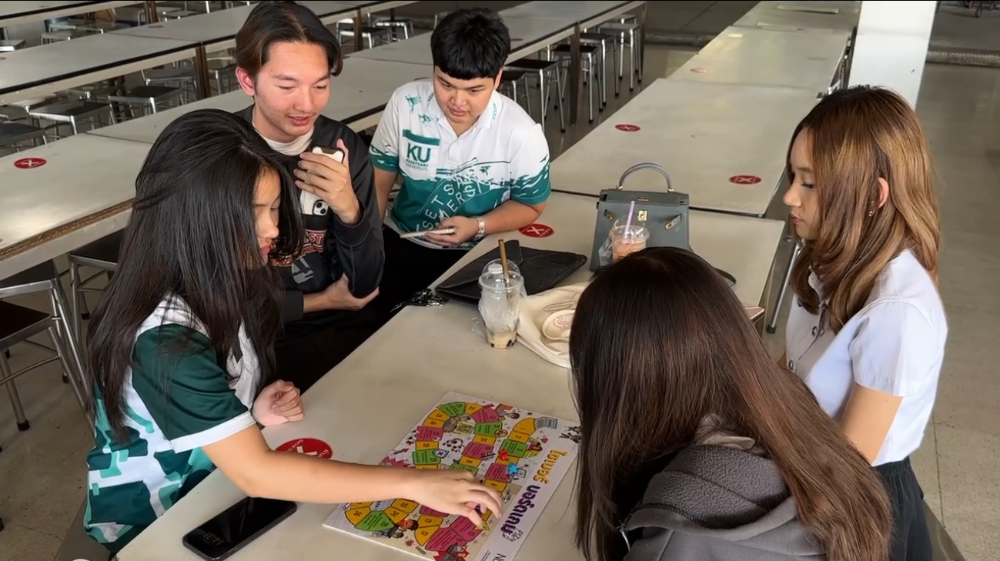

# Cyber Board Game (สกมช) by ก๊อง V3

ในวันที่ 7 มกราคม 2568 ที่ผ่านมา ณ บริเวณโรงอาหาร มหาวิทยาลัยเกษตรศาสตร์ วิทยาเขตศรีราชา  
"กลุ่มก๊อง V3" นิสิตคณะวิทยาศาสตร์ ศรีราชา สาขาวิทยาการคอมพิวเตอร์ ได้จัดกิจกรรมส่งเสริมความรู้ด้านการรักษาความปลอดภัยไซเบอร์ โดยใช้ไซเบอร์บอร์ดเกมที่ได้จาก 
สำนักงานคณะกรรมการการรักษาความมั่นคงปลอดภัยไซเบอร์แห่งชาติ (สกมช.) เป็นกิจกรรมดี ๆ เพื่อมอบความรู้ ความเข้าใจให้กับกลุ่มนิสิตภายในมหาวิทยาลัย

กิจกรรมครั้งนี้ได้รับความสนใจจากกลุ่มนิสิตคณะวิทยาการจัดการ สาขาธุรกิจระหว่างประเทศ เป็นผู้ที่สนใจเข้าเล่นเกมจำนวน 3 คน และให้ความร่วมมือเป็นอย่างดี นอกจากการเล่นเกมเพื่อความสนุกสนานแล้ว ผู้เข้าร่วมยังได้แลกเปลี่ยนความคิดเห็นเกี่ยวกับหลักการและแนวปฏิบัติในการรักษาความปลอดภัยทางไซเบอร์ รวมถึงการปฏิบัติตามกฎหมายที่เกี่ยวข้องต่าง ๆ

ความพิเศษของกิจกรรมนี้ คือการเปิดโอกาสให้ผู้เข้าร่วมทุกคนได้รับรู้ถึงความสำคัญของการป้องกันภัยคุกคามในโลกดิจิทัล ไม่ว่าจะเป็นในมุมมองของเยาวชนหรือผู้ใหญ่ ซึ่งเป็นสิ่งที่ต้องใส่ใจและให้ความสำคัญอย่างจริงจัง กิจกรรมดังกล่าวจึงไม่เพียงแต่ให้ความสนุก แต่ยังช่วยสร้างความรู้ความเข้าใจและความตระหนักรู้ให้กับทุกคนที่เข้าร่วมอีกด้วย

# สมาชิก

[6530200525 นายสิทธิกร ประทุมวัน](https://6530200525.github.io/boardgame)

[6530200088 นายชลสิทธิ์ กิจกุลพิเชฐ](https://markchonlasit.github.io/chonlasitK.github.io/boardgame)

[6530250395 นายธนบดี บุญสุข](https://realalunda.github.io/cyberboardgame)

[6530250166 นายพิชานัต พรหมณี](https://naieric.github.io/cyberboardgame)

[6530200835 นายสรสิช ปัญญางค์](https://bossmahob.github.io/cyberboardgame.html)

[6530250093 นายธนพัฒน์ อุไรวงษ์](https://friday1313.github.io/cyberboardgame)
