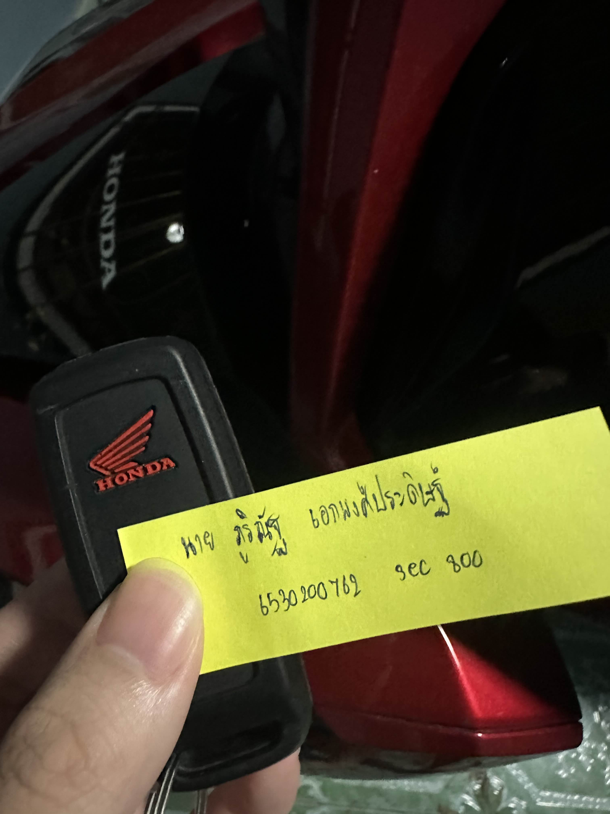

# Security-Control

กุญแจรถมอเตอร์ไซค์ดิจิทัล (Smart key)

Location => บ้าน

Control Function => Preventative

Type of SecurityControl => Physical Control

การทำงานของ Smart Key ในมอเตอร์ไซค์ใช้เทคโนโลยีการสื่อสารไร้สาย เช่น RFID (Radio Frequency Identification) หรือ Bluetooth ในบางรุ่นเพื่อเชื่อมต่อระหว่างตัวกุญแจ (Smart Key) และระบบควบคุมในมอเตอร์ไซค์

